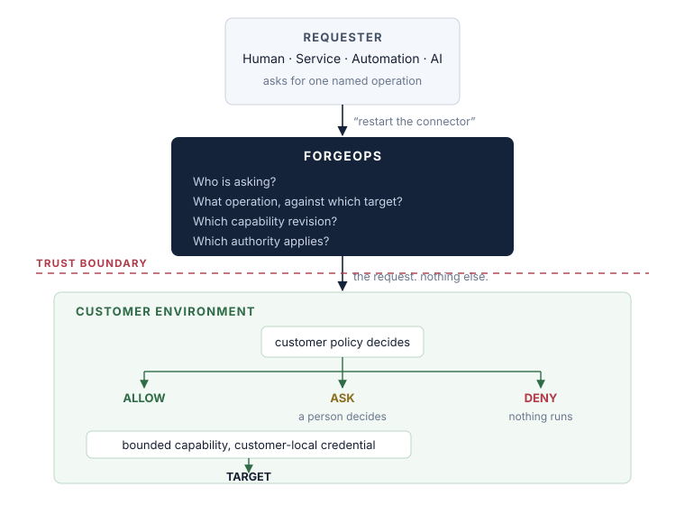
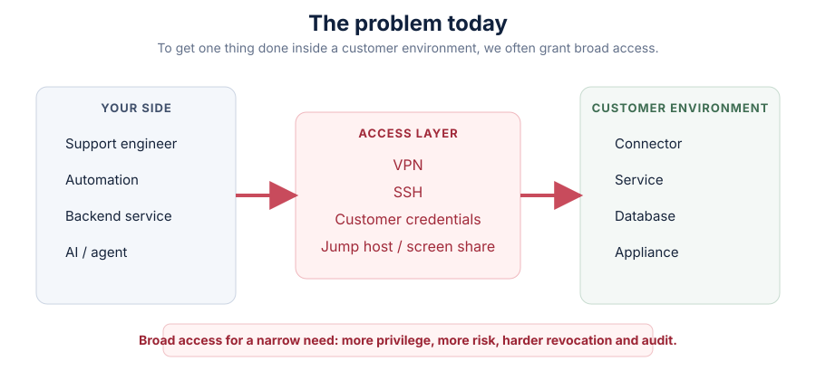
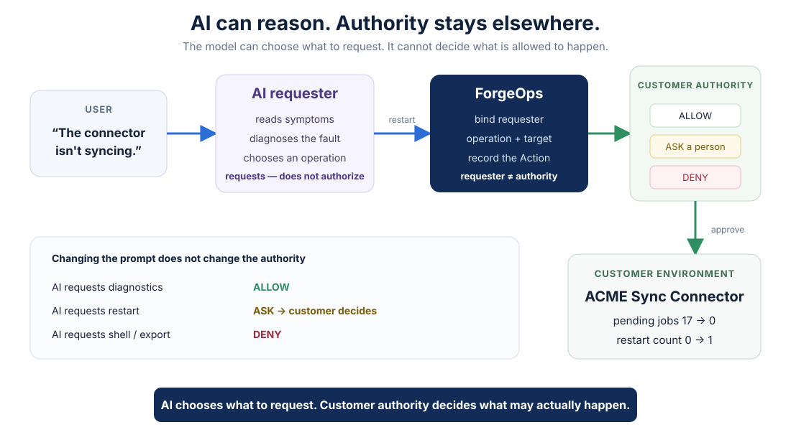
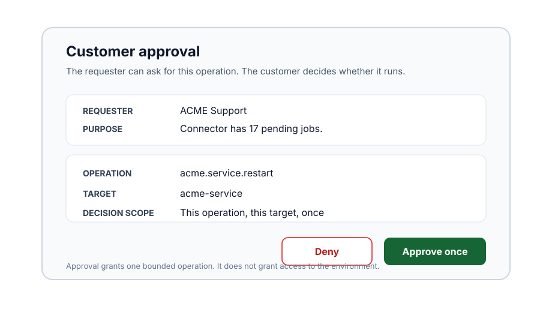
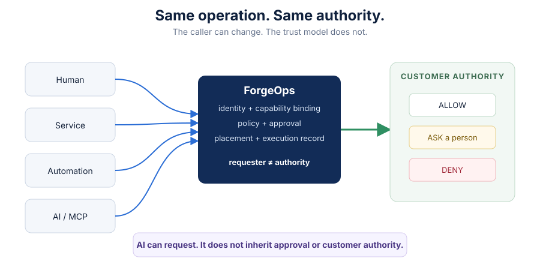

# ForgeOps

**Operate your software inside customer environments — without standing access.**



You request an operation. The customer keeps authority.

```text
read diagnostics        ALLOW   runs immediately
restart the connector   ASK     waits for a person on the customer's side
open a shell            DENY    refused, and nothing happens
```

## In sixty seconds

Your connector, service or appliance runs inside an enterprise customer's
environment. Something goes wrong. You need to inspect it, restart it or apply a
bounded fix.



Today that often means asking for access: VPN, SSH, a jump host, a customer
credential or a screen-share with someone who has one.

ForgeOps changes the primitive. The requester asks for **one named operation**.
The customer's environment decides whether that operation may run and performs
it with customer-local authority.

The requester does not receive SSH, VPN, a customer credential or a route into
the environment.

**The ability to request an operation is not the authority to perform arbitrary ones.**

## Try ForgeOps

Two demos. Same authority model.

| | **Demo 1 — Core authority** | **Demo 2 — AI + MCP** |
|---|---|---|
| See | `ALLOW` / `ASK` / `DENY` against a real local target | a real model diagnose, reason and request through MCP |
| Requester | fixed first-touch scenario | real AI model |
| Important moment | restart stops for another identity to decide | AI chooses an operation, then still stops at customer authority |
| Start | `./try-forgeops` | `./try-with-ai` |
| Walkthrough | **[Run Demo 1 →](demo/BASIC.md)** | **[Run Demo 2 →](demo/AI.md)** |

Both use the same downloadable first-touch bundle. No account, email or form is
required. Start at the **[demo chooser](demo/)** for prerequisites, the visual
walkthrough and Linux notes.

### Demo 1 — Core authority

The customer system is synthetic. The operations are not. Diagnostics read its
real state, approval really gates the restart, and a denied operation produces
no target effect.


```bash
./try-forgeops
```

**[Download and run Demo 1 →](demo/BASIC.md)**

### Demo 2 — AI + MCP

Put a real model in the requester seat. It receives connector symptoms, discovers
MCP tools and decides whether restart, resync, waiting or no action makes sense.
It can request an operation; it cannot approve itself or widen customer policy.



```bash
./try-with-ai
```

**AI can reason about what to do. It does not decide what it is allowed to do.**

**[Run Demo 2 — AI + MCP →](demo/AI.md)**

## What opens in the browser

When an Action reaches `ASK`, the demo opens the **ForgeOps Approval PWA**. The
customer sees who asked, why, the exact operation and the target before deciding.



The checked-in image is a schematic preview; the demo opens the actual browser
surface locally. Demo 2 also opens a local chat view with the connector's live
state beside the conversation, so you can verify effects independently of what
the model says.

## How it works

- [What just happened](docs/concepts/what-just-happened.md) — follow one request
  through Action, placement, policy, approval and effect.
- [Why this isn't remote access](docs/concepts/not-remote-access.md) — the
  distinction that matters and the ways this class of claim gets faked.
- [Visual walkthrough](demo/VISUAL-GUIDE.md) — see the first-touch trust model
  before running anything.

## Humans, services, automation and AI use the same path



The caller can change. The trust model does not.

AI is useful here because it makes the separation obvious: a model may reason,
choose a tool and request a consequential operation, while policy, approval,
credentials and execution authority remain independent of the model.

That does **not** make ForgeOps an AI-agent framework. AI is one requester type.

## What the local demos do and do not prove

[Read this before believing the stronger claims.](docs/concepts/what-this-proves.md)

The first-touch demos run the logical vendor, ForgeOps and customer sides on one
machine. They prove bounded operations, distinct authority, real target effects
and real refusals. A laptop cannot prove a physical network boundary, an
unreachable target or evaluator-owned edge independence; those require the next
evaluation level.

## Bring your own operation

Start from the small worked example, build one bounded operation of your own and
send it through the same Action, placement and customer-side policy path:

```bash
./try-forgeops --with ./my-capability
```

The [bring-your-own-operation walkthrough](demo/BRING-YOUR-OWN.md) has the
manifest contract, the two HTTP endpoints a runtime serves, and how to check
that the customer-side edge really executed your code. Start from
[`examples/inventory-check/`](examples/inventory-check/).

## Have a real operation like this?

Try ForgeOps anonymously first. If the demo resembles an operation you need
inside a customer environment, tell us about the operation and how you handle it
today.

**[Tell us about the operation](https://ykdynamics.com/en/forgeops)**

The evaluator form asks what runs customer-side, what operation is needed, the
current workaround and who should retain final authority. It is not required to
download or run ForgeOps.

## Where else this fits

Software vendors operating what they shipped is the sharpest version of the
problem and the one this repository leads with. The underlying primitive —
separating the ability to *request* an operation from the authority to *perform*
one — is more general.

See [the use-case collection](docs/use-cases/).

## What ForgeOps is not

Not a remote-support tool, an SSH or VPN replacement with a nicer UI, a workflow
engine, an approval app, or an AI-agent framework. Those categories put trust in
different places.

If ForgeOps still reads like one of them after the demos, that is useful
feedback — see [CONTACT.md](CONTACT.md).

## Status

ForgeOps is early. The downloadable demos are real and run on your machine; the
product behind them is being evaluated with a small number of people rather than
sold as a self-service hosted service.

The binaries are not code-signed. Steps beyond first touch — for example running
against an edge you operate or shaping a production operation — currently happen
with us rather than through a public hosted control plane.

## Evaluation terms

This repository is public for **evaluation and testing**, not as an open-source
release. Copyright © 2026 YK Dynamics. All rights reserved. See
[NOTICE.md](NOTICE.md) for the evaluation notice and contact us before reuse,
redistribution or commercial use beyond evaluation.

## Talk to us

[I have an operation like this](CONTACT.md) — four questions, and permission to
tell us it does not fit.
