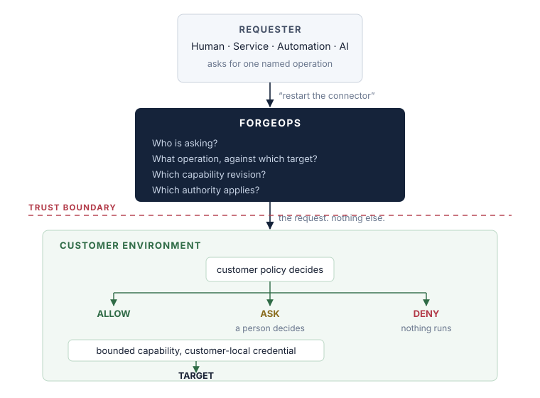

# ForgeOps

**Operate your software inside customer environments — without standing access.**

> **The ability to request an operation is not the authority to perform it.**

You ask for one named operation. The customer's own side decides whether it
runs, and runs it there with its own credentials.



```text
read diagnostics        ALLOW   runs immediately
restart the connector   ASK     waits for a person on the customer's side
open a shell            DENY    refused, and nothing happens
```

No VPN, no SSH, no customer password, no route into their network. Not for you,
and not for an AI acting for you.

## 1. Watch it (one minute)

A real AI model is asked to fix a stuck connector. It reads the connector's
state and asks for a restart; the customer's side holds the request until a
person approves it in the approval page; a request for shell access is refused
outright.


Recorded from the download below, on one laptop, captioned and edited for pace.

## 2. Try it yourself (five minutes, free, no account)

Everything runs on your machine. You need macOS or Linux, Docker running,
`curl`, `python3`, `lsof` and `bash`.

```bash
BASE=https://eu2.contabostorage.com/d89295baa09047ca80427839e7799618:forgeops/first-touch/70c2e2857ead
KIT="forgeops-first-touch-$(uname -s | tr 'A-Z' 'a-z')-$(uname -m | sed 's/x86_64/amd64/;s/aarch64/arm64/').tar.gz"
curl -O "$BASE/$KIT" && curl -O "$BASE/$KIT.sha256"
shasum -a 256 -c "$KIT.sha256" 2>/dev/null || sha256sum -c "$KIT.sha256"
tar --exclude='._*' -xzf "$KIT" && cd "$(tar -tzf "$KIT" | cut -d/ -f1 | grep -v '^\._' | head -1)"

./try-forgeops      # Demo 1: ALLOW, ASK and DENY, with you as the approver
./try-with-ai       # Demo 2: the same, with a real AI model asking
```

| | What you see | Walkthrough |
|---|---|---|
| **Demo 1 — Core authority** | diagnostics run, a restart waits for your approval, a shell is refused with nothing touched | [demo/BASIC.md](demo/BASIC.md) |
| **Demo 2 — AI + MCP** | a model diagnoses and asks; it cannot approve itself, reach the connector or widen the policy | [demo/AI.md](demo/AI.md) |

Checksums, ports, Linux notes and troubleshooting are in the
[Demo 1 walkthrough](demo/BASIC.md); the binaries are not code-signed. Prefer
pictures first? [Visual walkthrough](demo/VISUAL-GUIDE.md). Want to send an
operation of your own through it? [Bring your own operation](demo/BRING-YOUR-OWN.md).

## 3. See it on real hardware (a live session with us)

The download puts every side on one laptop, so it cannot show a real network
boundary. In a live session we show the split the way it would really be: our
laptop as the vendor, and a separate small computer, a Raspberry Pi on its own
network, as the customer's site.


*This is a recording of our own setup, shown so you know what a session looks
like. It is not what the download contains.*

In a session you see:

- the customer's box **calling out** over an encrypted link, and nothing able to
  call in;
- the box's **own screen** saying what it decided and did: holding for a person,
  approved, verified, refused;
- the outcome **checked on the customer's side** ("verified: the queue is
  draining"), not just "the command ran";
- what happens when you **pull the power or the network** while a request waits
  for approval: it expires, a late approval is refused, nothing runs afterwards;
- optionally, a real AI model in the vendor's seat.

About 30 to 45 minutes, online (we film the box) or in person.
**[Ask for a live session](CONTACT.md#ask-for-a-live-session)**.

## 4. Go deeper

- **How it works:** [what just happened](docs/concepts/what-just-happened.md),
  one request followed through every step.
- **Why it isn't remote access:** [the difference](docs/concepts/not-remote-access.md),
  and how this kind of claim gets faked.
- **What the demos prove, and what they don't:** [read before believing the
  stronger claims](docs/concepts/what-this-proves.md).
- **Where it fits:** [software vendors, governed automation, AI agents,
  sovereign edge](docs/use-cases/), and [where this could go](docs/direction.md).

**What ForgeOps is not:** a remote-support tool, an SSH or VPN replacement with a
nicer UI, a workflow engine, an approval app, or an AI-agent framework. AI is one
kind of requester, nothing more.

## Status and terms

ForgeOps is early. The demos are real and run on your machine; the product
behind them is being evaluated with a small number of people, not sold as a
self-service hosted service.

This repository is public for **evaluation and testing**, not as an open-source
release. Copyright © 2026 YK Dynamics. All rights reserved. See
[NOTICE.md](NOTICE.md).

**Have an operation like this?** [Tell us about it](CONTACT.md) — four questions,
and permission to tell us it does not fit.
