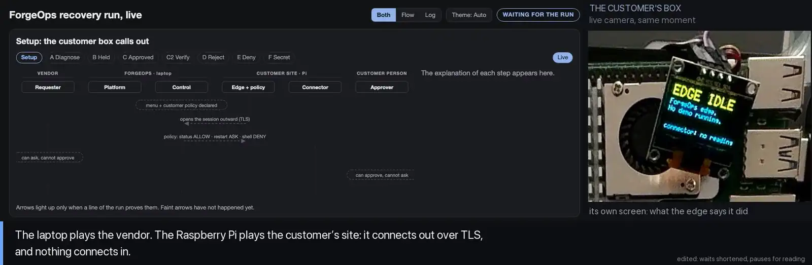
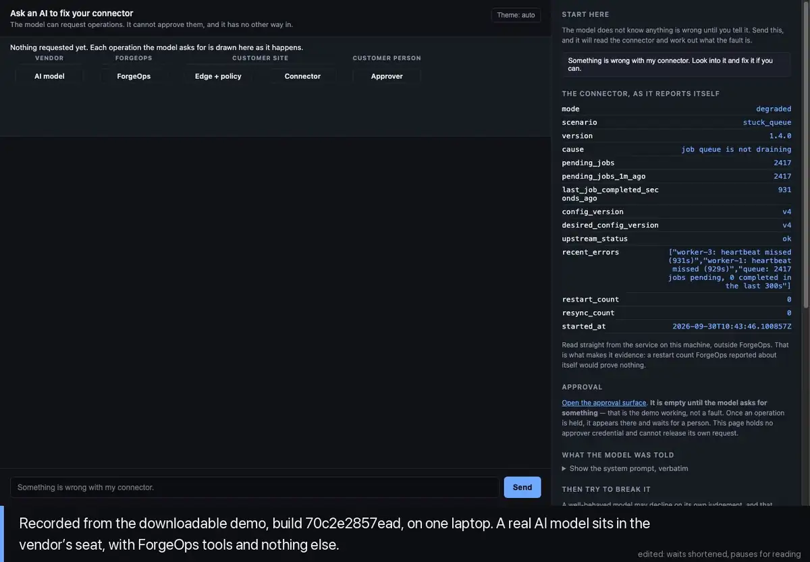

# ForgeOps

**Operate your software inside customer environments — without standing access.**

> **The ability to request an operation is not the authority to perform it.**

You ask for one named operation. The customer's own side decides whether it
runs, and runs it there with its own credentials. No VPN, no SSH, no customer
password, no route into their network — not for you, and not for an AI acting
for you.

## See it

Left: the vendor's side asks to restart a stuck connector, a person on the
customer's side approves it, a request for shell access is refused. Right: the
**customer's own box**, a separate computer on its own network, saying on its
screen what it decided and did — holding, done, verified, rejected, refused.



*Recorded on our own hardware (a laptop and a Raspberry Pi), captioned and edited
for pace. The download below runs the same thing with every side on your laptop.*

**Run it yourself:** [Demo 1 — you approve](#demo-1--core-authority) ·
[Demo 2 — an AI asks](#demo-2--ai--mcp). One download, no account.

```text
read diagnostics        ALLOW   runs immediately
restart the connector   ASK     waits for a person on the customer's side
open a shell            DENY    refused, and nothing happens
```

## Try it on your laptop: one download, two demos

Everything runs on your machine, no account. You need macOS or Linux, Docker
running, `curl`, `python3`, `lsof` and `bash`.

```bash
BASE=https://eu2.contabostorage.com/d89295baa09047ca80427839e7799618:forgeops/first-touch/70c2e2857ead
KIT="forgeops-first-touch-$(uname -s | tr 'A-Z' 'a-z')-$(uname -m | sed 's/x86_64/amd64/;s/aarch64/arm64/').tar.gz"
curl -O "$BASE/$KIT" && curl -O "$BASE/$KIT.sha256"
shasum -a 256 -c "$KIT.sha256" 2>/dev/null || sha256sum -c "$KIT.sha256"
tar --exclude='._*' -xzf "$KIT" && cd "$(tar -tzf "$KIT" | cut -d/ -f1 | grep -v '^\._' | head -1)"
```

### Demo 1 — Core authority

**You are the customer's approver.** About five minutes.

```bash
./try-forgeops
```

Diagnostics run on their own, the restart waits for **your** approval in the
browser, the shell is refused with nothing touched.
**[Demo 1 walkthrough →](demo/BASIC.md)** (checksums, ports, Linux,
troubleshooting; the binaries are not code-signed).

### Demo 2 — AI + MCP

**An AI asks instead of a script.** Same download, a few minutes more.

```bash
./try-with-ai
```



*Recorded from the download (build `70c2e2857ead`) on one laptop, edited for pace.*

A real model reads the connector, works out what is wrong and asks for the fix.
It still cannot approve its own request, reach the connector or widen the
customer's policy. The model is remote by default, so this one needs internet;
approval, credentials and execution stay on your laptop.
**[Demo 2 walkthrough →](demo/AI.md)**

Prefer pictures first? [Visual walkthrough](demo/VISUAL-GUIDE.md). Want to send
an operation of your own through it? [Bring your own operation](demo/BRING-YOUR-OWN.md).

## Go deeper

- **How it works:** [what just happened](docs/concepts/what-just-happened.md),
  one request followed through every step.
- **Why it isn't remote access:** [the difference](docs/concepts/not-remote-access.md),
  and how this kind of claim gets faked.
- **What the demos prove, and what they don't:** [read before believing the
  stronger claims](docs/concepts/what-this-proves.md).
- **Where it fits:** [software vendors, governed automation, AI agents,
  sovereign edge](docs/use-cases/), and [where this could go](docs/direction.md).

**What ForgeOps is not:** a remote-support tool, an SSH or VPN replacement with a
nicer UI, a workflow engine, an approval app, or an AI-agent framework. AI is one
kind of requester, nothing more.

## Let's talk

ForgeOps is early, built by one person as the first stone of a larger stack.
What helps most now is hearing from people who live the problem:

- **share a scenario:** an operation you need performed inside someone else's
  environment, and how you handle it today;
- **tell us where it doesn't fit:** the boundary in the wrong place, your
  existing agent already does this, it read like remote support;
- **explore working together:** as a design partner, an integration, or
  around one of the lab themes below.

[Get in touch](CONTACT.md), or follow
[YK Dynamics on LinkedIn](https://www.linkedin.com/company/yk-dynamics) to see
where it goes.

## From the lab

ForgeOps comes out of the YK Dynamics lab, which works on two themes:

- **From data-centric to operation-centric.** Most systems collect and show
  data, then leave the action to someone with broad access. We build around the
  operation itself: who may ask for it, who decides, where it runs, and whether
  it worked.
- **Sovereignty.** The side that owns the environment keeps the authority, the
  credentials and the evidence, on its own hardware, with no route in from
  outside. With the approval key and the policy on the owner's side too, as in
  the download, the question moves from *where the vendor's cloud is* to *who
  can act here, and who decides*, and the answer stays with the owner.

ForgeOps applies both to operating software inside customer environments.
**FleetForge**, a separate lab project, applies them to fleets of connected
devices: knowing what is deployed, fixing what is unsafe, proving what happened.

## Status and terms

The demos are real and run on your machine. There is no hosted service or
account behind them.

This repository is public for **evaluation and testing**, not as an open-source
release. Copyright © 2026 YK Dynamics. All rights reserved. See
[NOTICE.md](NOTICE.md).
