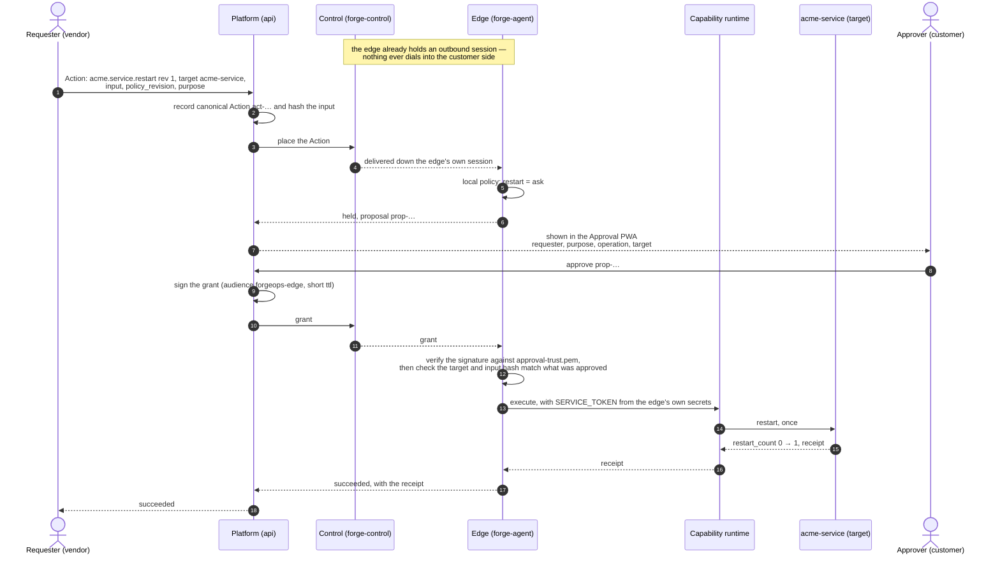
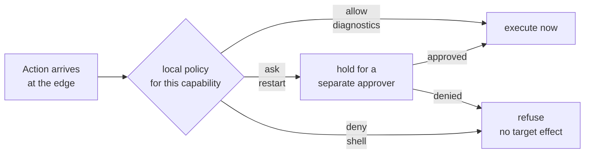

# Demo 1 — Core authority

**See the ForgeOps trust model first: ALLOW, ASK and DENY against a real local target.**

```bash
./try-forgeops
```

| | |
|---|---|
| Time | about 2 minutes |
| Runs | locally on your machine |
| Account | none |
| Requires | Docker, `curl`, `python3`, `lsof`, `bash` |
| Network | Postgres image download on first run; no ForgeOps service is contacted |
| Cleanup | `bash scripts/first-touch-reset.sh` |

The customer system is synthetic. The operations are not. Diagnostics read the
connector's real state, approval really gates the restart, and a denied request
produces no target effect.

## What you will see

Three requests go through the same authority path:


```text
read diagnostics       ALLOW   runs immediately, returns connector state
restart the connector  ASK     stops until the customer decides
open a shell           DENY    refused; the connector is untouched
```

The interesting part is not that the restart works. It is that the requester
cannot make the shell work, and cannot release the held restart by itself.

## What opens in your browser

When the restart reaches `ASK`, the terminal prints a localhost link to the
**ForgeOps Approval PWA**. The page shows the exact requester, purpose,
operation and target being decided.

This checked-in preview shows the information you should expect to see; the demo
opens the real browser surface.


Approve once and the connector's `restart_count` moves from `0` to `1`. Run the
held case again and deny it: the counter stays where it is.

## Before you download

```text
Docker           running (the demo starts a Postgres container)
curl, python3, lsof, bash
ports free       8010-8012, 8080, 8089, 8093-8095, 18054-18057, 55454
about 1 GB       the kit plus the Postgres image on first run
```

Every demo port binds to localhost. Nothing opens an inbound route to your
machine.

## Download

Pick your platform:

| Platform | Bundle |
|---|---|
| macOS, Apple silicon | `forgeops-first-touch-darwin-arm64.tar.gz` |
| macOS, Intel | `forgeops-first-touch-darwin-amd64.tar.gz` |
| Linux, x86-64 | `forgeops-first-touch-linux-amd64.tar.gz` |
| Linux, arm64 | `forgeops-first-touch-linux-arm64.tar.gz` |

```bash
BASE=https://eu2.contabostorage.com/d89295baa09047ca80427839e7799618:forgeops/first-touch/d5c50a10e10f
KIT=forgeops-first-touch-darwin-arm64.tar.gz    # change to match your platform

curl -O "$BASE/$KIT"
curl -O "$BASE/$KIT.sha256"
shasum -a 256 -c "$KIT.sha256"

tar --exclude='._*' -xzf "$KIT"
cd "$(tar -tzf "$KIT" 2>/dev/null | cut -d/ -f1 | grep -v '^\._' | head -1)"
./try-forgeops
```

The binaries are not code-signed. On macOS, downloading with `curl` avoids the
browser quarantine flag that would otherwise stop an unsigned binary from
starting. Check the SHA-256 file anyway: it is the integrity claim available for
this early preview.

The artifact path includes a build identifier. Published builds are not
overwritten.

If you are testing on Linux, see the [Linux quick start](LINUX.md).

## The run, in one screen

A normal run looks roughly like this:

```text
== starting Postgres, Platform and Control ==
OK: Platform and Control ready

== starting ACME Sync Connector, capability runtimes and edge ==
OK: first-touch-edge Ready

== diagnostics ALLOW ==
OK: pending_jobs=17 config=v4 restart_count=0

== restart ASK ==
Open http://127.0.0.1:18057/#ft=... and approve proposal ...
OK: restart approved and executed exactly once

== deny a held restart ==
Open the approval page and reject proposal ...
OK: denied restart produced zero target effect

== shell DENY ==
OK: shell refused by customer policy; target unchanged

FIRST-TOUCH PASSED
```

The demo stops for approval because the Action has reached the customer side and
cannot continue without another identity making the decision.

## What is actually running

Everything is on one laptop for first touch, but the logical sides stay
separate:


| Binary | Side | Purpose |
|---|---|---|
| `forgectl` | requester/operator | drives the fixed first-touch scenario |
| `forge-mcp` | requester | exposes the same capabilities to MCP callers |
| `api` | ForgeOps | records the canonical Action and proposal state |
| `forge-control` | ForgeOps | places the Action and relays the result |
| `forge-agent` | customer | enforces policy and owns the local credential path |
| `acme-service-status` | customer | reads target state |
| `acme-service-restart` | customer | performs one bounded restart |
| `acme-service` | customer | fictional target with observable real state |

The edge opens the session outward. Nothing dials into the customer side.

## What actually happens, in order

The component view above is where things sit. This is the order they move in,
for the restart — the one operation that stops.



Two things in that order matter more than the rest.

**Step 4 is a delivery, not a connection.** Control does not reach into the
customer side; it hands the Action to a session the edge opened outward. You can
watch that session come up in the edge's own log, `agent.log` in the run's work
directory under `/tmp/forgeops-first-touch-kit.*`:

```text
agent: first-touch-edge maintains an outbound session at 127.0.0.1:8012
agent: first-touch-edge session live at 127.0.0.1:8012
```

**Step 12 is where an approval becomes an effect, and it is checked twice.** The
edge verifies who signed the grant, then verifies that the operation and target
in it are the ones the approver was shown. Only then does it supply the
credential (13) and let the restart happen, once (14). A grant for a different
target does not execute — approving one thing cannot release another.

### Where the three outcomes diverge

All three requests take the same path to the edge. They separate at one point:



The decision is the customer's policy, evaluated on the customer's side, after
the Action has already arrived. That is why the refusal is not a missing feature
on the vendor side — the request was made, reached the edge, and was stopped
there.

### The run, phase by phase

Each banner in the terminal maps to one of those layers doing one thing:

| Banner | What is happening |
|---|---|
| `using the bundled ForgeOps runtime` | prebuilt binaries from the kit; nothing is compiled |
| `preparing local ports` | frees the fixed loopback ports the demo uses |
| `starting Postgres, Platform and Control` | the ForgeOps side comes up; canonical-input enforcement on |
| `declaring the first-touch fabric` | applies Environment, four Capabilities, Agent, Policy — 7 resources |
| `starting ACME Sync Connector, capability runtimes and edge` | the customer side comes up and the edge reaches `Ready` |
| `provisioning requester and customer-approver identities` | two distinct subjects; the requester cannot approve |
| `A. diagnostics ALLOW` | policy allows, no human, target state returned |
| `B/C. restart ASK` | held at the edge until the PWA decision, then one real effect |
| `D. denying a held restart` | same path, opposite decision, `restart_count` unchanged |
| `shell DENY` | refused by policy; never reaches the target |

The fabric and identity phases are the ones worth not skipping. The policy that
stops the restart is applied in the fourth phase, from a file, and the identity
that can approve it is created in the sixth — separately from the one that asks.

## How a requester asks

The demo is driven for you, but the product contract is an Action. A normal
request binds the exact operation, revision, target, input and policy context
before placement:

```http
POST /v1/tenants/{tenant}/actions
Authorization: Bearer <workspace token>

{
  "workspace_id":        "ws-1",
  "capability_uid":      "acme.service.restart",
  "capability_revision": 1,
  "target":              "acme-service",
  "input":               {"service": "acme-service"},
  "policy_revision":     1,
  "idempotency_key":     "restart-after-queue-alert",
  "max_attempts":        1,
  "request_purpose":     "Connector has 17 pending jobs."
}
```

`capability_revision` pins which operation was requested. `request_purpose` is
what the customer reads when the Action needs approval.

The AI/MCP demo uses the same Action path. `forge-mcp` is an adapter in front of
it, not a second execution route.

## Where the credential lives

The fictional connector requires a token for restart. The edge keeps that token
on the customer side and supplies it only to the bounded capability. The
requester never receives it.

That is the point of the arrangement: the requester causes one authorized
effect without being given general access to the environment.

## Inspect it further

```bash
forgectl pending          # held calls
forgectl approvals        # proposal ledger
forgectl audit --tail 20  # request / decision / execution record
forgectl edges            # edge status
forgectl doctor           # boundary-oriented diagnostics
```

For the diagram-first explanation, see the [visual walkthrough](VISUAL-GUIDE.md).
For exact claim boundaries, see [what the local demo does and does not prove](../docs/concepts/what-this-proves.md).

## Next: change the requester to AI

Once the authority model is clear, run **Demo 2 — AI + MCP**:

```bash
./try-with-ai
```

[Continue to Demo 2 →](AI.md)

## Start over

```bash
bash scripts/first-touch-reset.sh
```
