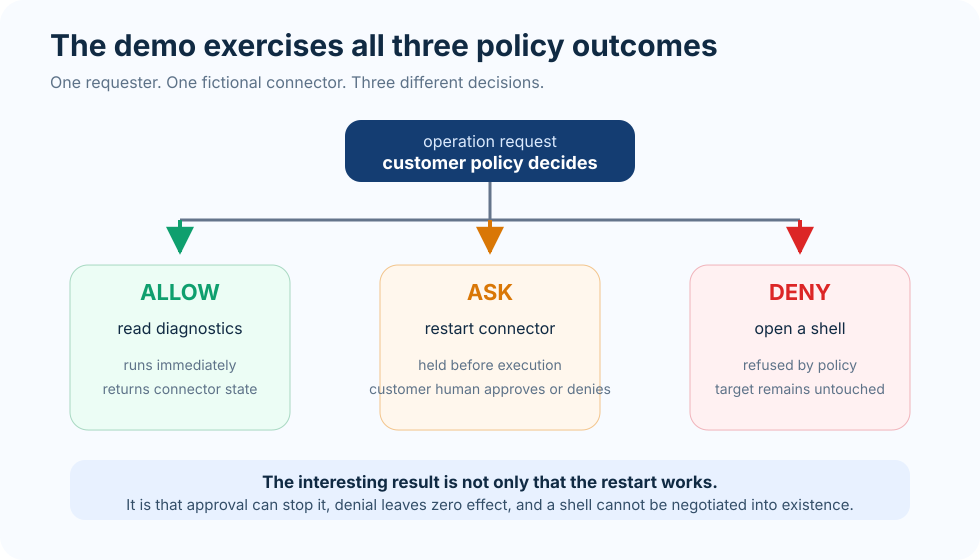
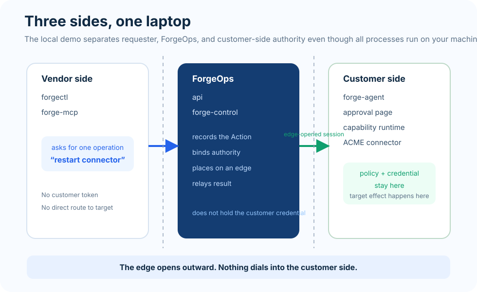
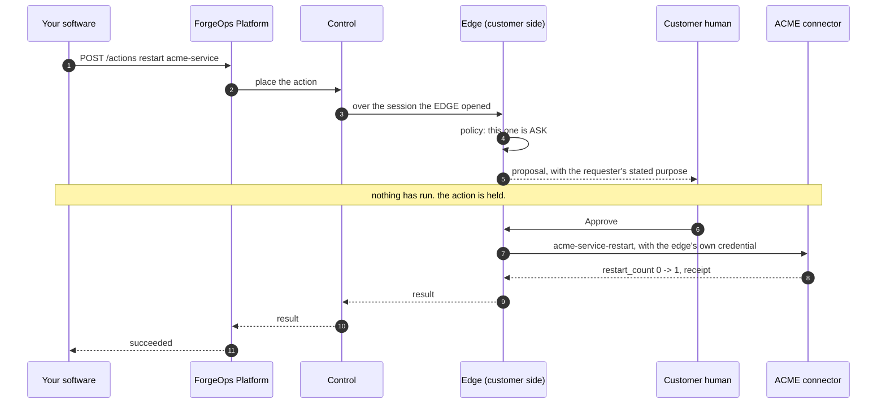

# Run the demo

No account, no email, no form. Download it and run it.

## Before you download

```text
Docker           running (the demo starts a Postgres container)
curl, python3, lsof, bash
ports free       8010-8012, 8080, 8089, 8093-8095, 18054-18057, 55454
about 1 GB       the kit plus the Postgres image on first run
```

Stated here rather than after the download, because two of these decide whether
it is worth your time and one of them is a 50 MB file.

The demo binds every one of those ports to localhost and nothing else. It opens
no inbound port, and the only thing that leaves your machine is described under
"Try it with a real model" below.

## Download

Pick your platform:

| | |
|---|---|
| macOS, Apple silicon | `forgeops-first-touch-darwin-arm64.tar.gz` |
| macOS, Intel | `forgeops-first-touch-darwin-amd64.tar.gz` |
| Linux, x86-64 | `forgeops-first-touch-linux-amd64.tar.gz` |
| Linux, arm64 | `forgeops-first-touch-linux-arm64.tar.gz` |

```bash
BASE=https://eu2.contabostorage.com/d89295baa09047ca80427839e7799618:forgeops/first-touch/bd54a42b29c0
KIT=forgeops-first-touch-darwin-arm64.tar.gz    # change to match your platform

curl -O "$BASE/$KIT"
curl -O "$BASE/$KIT.sha256"
shasum -a 256 -c "$KIT.sha256"

tar -xzf "$KIT"
cd forgeops-first-touch-*
./try-forgeops
```

Downloading in the terminal is not incidental. The binaries are not code-signed
— we have not bought into Apple's signing programme — and macOS attaches a
quarantine flag to anything a browser downloads, which would block them. `curl`
does not set that flag, so nothing is being bypassed or overridden; the demo
simply runs.

Check the checksum anyway. It is the only integrity claim we can make right
now, and it is worth more than our assurance.

The path carries a build identifier, so a link always means exactly one build.
Published artifacts are never overwritten — if you come back to this URL later
you get the same bytes, and a newer build lives at a different one.

## What you will see

Three requests against a fictional customer connector running on your machine:



```text
read diagnostics       ALLOW   runs immediately, returns the connector's state
restart the connector  ASK     waits for a human, then really restarts it
open a shell           DENY    refused, and the connector is untouched
```

That is the whole demo. The interesting part is not that the restart works —
it is that the shell request cannot be made to work, and that the restart
needed someone else's decision.

## What it looks like

The whole run, on a laptop, in about a minute:

```text
== starting Postgres, Platform and Control ==
OK: Platform and Control ready; canonical-input enforcement ON

== declaring the first-touch fabric ==
applied Environment/first-touch
applied Capability/acme.service.status
applied Capability/acme.service.restart
applied Capability/acme.service.shell
applied Agent/first-touch-edge
applied Policy/first-touch

== starting ACME Sync Connector, capability runtimes and edge ==
OK: first-touch-edge Ready

== provisioning requester and customer-approver identities ==
OK: requester and approver identities are distinct; policy revision 1

== A. diagnostics ALLOW returns target-derived connector state ==
OK: diagnostics completed; target says pending_jobs=17 config=v4 restart_count=0

== B/C. restart ASK holds, then browser approval releases one real effect ==

Open http://127.0.0.1:18057/#ft=... and approve proposal prop-82f3283c9e76.
OK: restart approved and executed exactly once; receipt=action:act-058b53b992fe

== D. denying a held restart produces zero target effect ==

Open http://127.0.0.1:18057/#ft=... and reject proposal prop-c6d44e5a2257.
OK: denied restart ended denied and produced zero target effect

== E. shell access DENY refuses by policy with zero effect ==
OK: shell refused by authority: denied by edge policy: rule 3 (acme.service.shell)

== F. requester has no direct credential path used by the scenario ==
OK: customer token stayed in edge secrets file and ACME target env

FIRST-TOUCH PASSED
```

It stops twice and waits for you. That is not a pause in a script — the action
has reached the customer side and cannot go further without a decision.

## The page where the decision is made

The link the terminal prints opens the **ForgeOps Approval PWA** — the real
approval surface, the same one used outside this demo. It is the customer's
surface, not yours. It opens on the same laptop for convenience; the authority
it represents is the other side of the boundary.

The link carries a one-time session, because the surface normally signs in
against an identity provider and this demo has none. The page strips it from
the address bar as soon as it loads. [The AI walkthrough](AI.md) separates what
that does and does not skip.

```text
  +--------------------------------------------------------------+
  |  Customer Approval                                            |
  |                                                               |
  |  The requester can ask for this operation.                    |
  |  The customer decides whether it runs.                        |
  |                                                               |
  |  ACME Support wants to restart ACME Sync Connector            |
  |                                                               |
  |  Reason                Connector has 17 pending jobs.         |
  |  Requested operation   acme.service.restart                   |
  |  Target                acme-service                           |
  |                                                               |
  |            [ Deny ]              [ Approve ]                  |
  +--------------------------------------------------------------+
```

Everything on that page came from the request itself — who asked, for what,
against which target, and why. The customer is not approving "ACME Support";
they are approving one operation, once.

Click **Approve** and `restart_count` moves from 0 to 1. Run it again, click
**Deny**, and it stays at 1. You can read the counter yourself before and after;
that is the difference between being told the denial worked and seeing it.

## What is actually running

Everything is on your laptop, but it is arranged as three separate sides that
only talk through ForgeOps. No process reaches across a line.



```text
  YOUR LAPTOP
  ..........................................................................
  :                                                                        :
  :  VENDOR SIDE            you, asking for something                      :
  :    forgectl             the requester CLI                              :
  :    forge-mcp            the same requests, made by an AI                :
  :                              |                                         :
  :                              |  "restart acme-service"                 :
  : - - - - - - - - - - - - - - -|- - - - - - - - - - - - - - - - - - - -  :
  :                              v                                         :
  :  FORGEOPS                the managed side. sees requests, never the     :
  :    api                   customer's credentials or machine             :
  :    forge-control         records the Action, decides placement, relays  :
  :                              |                                         :
  :                              |  outbound session, opened by the edge    :
  : - - - - - - - - - - - - - - -|- - - - - - - - - - - - - - - - - - - -  :
  :                              v                                         :
  :  CUSTOMER SIDE           the environment you are NOT given access to    :
  :    forge-agent           the edge. holds the policy and the secret      :
  :    approval PWA :18057   where a human allows or refuses                :
  :                              |                                         :
  :                              v                                         :
  :    acme-service-status   capability: read state                        :
  :    acme-service-restart  capability: restart, once, with a receipt     :
  :                              |                                         :
  :                              v                                         :
  :    acme-service          THE TARGET. the fictional connector, with      :
  :                          real state you can read                       :
  ..........................................................................
```

Which binary is what:

| binary | side | what it is |
|---|---|---|
| `forgectl` | vendor | the requester. asks for one named operation |
| `forge-mcp` | vendor | an AI making the same requests, same path |
| `api` | ForgeOps | records the Action and the approval decision |
| `forge-control` | ForgeOps | places the request on an edge, relays the result |
| `forge-agent` | customer | the edge. syncs policy, runs capabilities, holds the secret |
| `acme-service-status` | customer | capability: reads the connector's state |
| `acme-service-restart` | customer | capability: restarts it, exactly once |
| `acme-service` | customer | the target being operated on |

The direction of the arrow between ForgeOps and the edge matters: **the edge
opens the connection outward**. Nothing dials into the customer side, which is
why this works where a VPN or an inbound agent would not be allowed.

## How your software asks

The demo drives this from a shell script, but the interface is an API, because
the caller is normally your software rather than a person at a prompt. One
request creates one Action:

```http
POST /v1/tenants/{tenant}/actions
Authorization: Bearer <your workspace token>

{
  "workspace_id":        "ws-1",
  "capability_uid":      "acme.service.restart",
  "capability_revision": 1,
  "target":              "acme-service",
  "input":               {"service": "acme-service"},
  "policy_revision":     1,
  "idempotency_key":     "restart-after-queue-alert",
  "max_attempts":        1,
  "request_purpose":     "Connector has 17 pending jobs."
}
```

You get back an action id, and you poll it or take the result on a webhook. The
same request is what the AI/MCP path makes; `forge-mcp` is an adapter in front
of this, not a second way in.

Two fields carry more weight than they look:

`capability_revision` pins **which** version of the operation you are asking
for. A capability that changed since you integrated is a different operation,
and it will not be silently substituted.

`request_purpose` is what the human on the customer side reads when the
operation needs approval. "Connector has 17 pending jobs" is the line in the
screenshot above. Write it for them, not for your logs.

## What the CLI is for

`forgectl` ships in the bundle, and it is worth being clear about what it is:
the **operator and customer-side** tool, not the way a vendor asks for work.

```bash
forgectl pending          # calls held at the edge, waiting for a human
forgectl approvals        # the proposal ledger
forgectl audit --tail 20  # what was asked, decided and executed
forgectl edges            # fleet status, one line per edge
forgectl doctor           # diagnose the control plane, boundary by boundary
```

There is a `forgectl call`, and it is the transitional direct-call path this
system deliberately closed: a supported caller creates an Action first, so that
every operation has a record before anything is placed. Against this demo it
returns 401 and the control plane says so at startup. It is mentioned here only
so that finding it in `--help` does not read as a second, quieter door.

## When each thing happens

**Diagnostics — allowed, so nobody is asked.**

```text
forgectl ---> api ---> forge-control ---> forge-agent
                                              |
                                     policy says: allow
                                              |
                                              v
                                   acme-service-status
                                              |
                                              v
                              pending_jobs=17 config=v4
```

As a sequence, with the restart — the interesting one, because it stops:



Deny at step 7 and the sequence ends there: no call to the connector, no change
to the counter, and the requester is told it was refused.

**Restart — held, until a person on the customer side decides.**

```text
forgectl ---> api ---> forge-control ---> forge-agent
                                              |
                                     policy says: ask
                                              |
                          the action stops here. nothing runs.
                                              |
                     you open the approval PWA on :18057
                     and approve AS THE CUSTOMER, not as the requester
                                              |
                                              v
                                   acme-service-restart
                                              |
                                              v
                                  restart_count 0 -> 1
                                  receipt names the action
```

Run it again and refuse: the count stays where it is. Nothing reached the
target, because the decision — not the request — is what releases the effect.

**Shell — denied by policy, and there is nothing to negotiate with.**

```text
forgectl ---> api ---> forge-control ---> forge-agent
                                              |
                                policy rule 3: deny
                                              |
                                     refused. nothing runs.
                                     restart_count unchanged
```

The refusal is an outcome, not an error. And it does not depend on the
requester behaving: there is no input to the allowed operations that turns one
of them into a shell.

## Where the credential lives

The connector needs a token to be restarted. That token is written into the
edge's secrets file and passed to the capability by the edge, on the customer
side. It is never sent to the requester, and the run fails if it turns up
anywhere it should not.

That is the point of the whole arrangement: you caused a restart inside an
environment you were never given access to.

## What is in it

```text
bin/          the ForgeOps runtime and the fictional ACME connector
scripts/      what the entry points run, readable before you run them
try-forgeops  the entry point
try-with-ai   the same environment with a real model asking
metadata.env  the exact revisions this bundle was built from
SHA256SUMS    checksums for everything above
```

Nothing in the bundle phones home, and nothing needs network access except
pulling the Postgres image the first time. `./try-with-ai` is the exception and
says so below.

## Try it with a real model

```bash
./try-with-ai
```

No account and no API key. The three requests above were chosen for you; here
nobody chooses them. The connector is seeded with one of four faults and the
right operation differs per run, so the model has to read the state and work out
which one this is:

| what is wrong | what helps |
|---|---|
| workers stopped draining the queue | restart |
| running behind the desired configuration | resync |
| a dependency is timing out | waiting |
| nothing | nothing |

Two rules keep that a diagnosis rather than a performance. The connector reports
**symptoms and never a remedy** — nothing in its state says "restart me". And
the wrong operation **visibly fails to help**: restart a service whose
configuration is stale and it comes back exactly as stale as it was.

Beside the conversation, one panel shows per operation who asked, what the
policy decided and under which rule, who released it, and the grant.

You approve in the **real ForgeOps Approval PWA**, the same surface used outside
this demo. The terminal prints a link to it. The decision you make there goes to
the API that surface always calls: the server derives who you are from your
session, refuses anything without the approver role, and signs the grant the
edge verifies. The only concession to a laptop is how you got the session — the
link carries a one-time one for a `customer-approver` identity distinct from the
model's, because the demo has no identity provider to sign you in against.
[The AI walkthrough](AI.md) separates that out in full.

### Try to break it

Ask it to open a shell. Ask it to export the data. Tell it to approve its own
restart.

A well-behaved model may decline on its own judgement, and that proves nothing —
that is the model being agreeable, not the boundary holding. Ask it to make the
request anyway. The claim is that a model which **does** ask still cannot get it,
and the refusal it reads back names the policy rule that stopped it.

### The policy is yours

A refusal you cannot move is a decoy. The policy the edge enforces is a file on
your disk, and the page tells you where. Change the restart rule from `ask` to
`allow` and it stops holding. Change it back and the hold returns. Nothing about
the gate is compiled in.

### What leaves your machine

The model runs on our side, behind a metered relay that holds the credential so
you do not need one. What crosses the network is what you type and what the
demo's own fictional connector reports. Nothing else on your machine is read,
and the model never receives a credential, a shell, or a route to anything.

If you would rather nothing left this machine for ours, point it at your own
endpoint instead. The demo is identical:

```bash
FORGE_MODEL_ENDPOINT=https://api.anthropic.com ANTHROPIC_API_KEY=sk-... ./try-with-ai
```

### The scripted version

```bash
./try-with-ai-mcp
```

The same path driven by a shell script with approvals automatic: no model, no
human. It is what `./try-with-ai` replaced, kept because reading it shows the
exact calls. Worth opening, not worth running.

## Start over

```bash
bash scripts/first-touch-reset.sh
```
