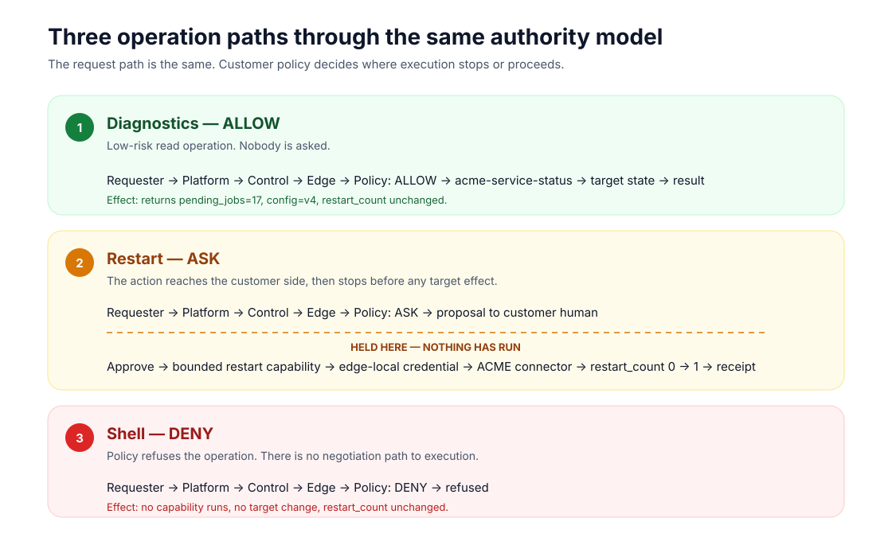
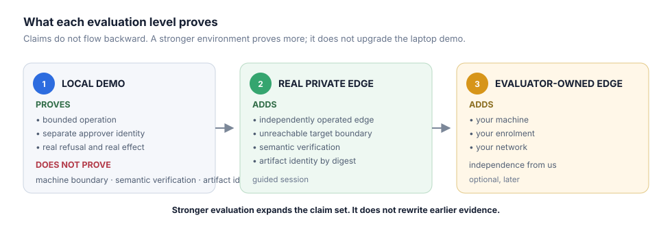

# ForgeOps demo — visual walkthrough

This page is the diagram-first version of the first-touch demo. The executable
transcript and exact commands remain in [README.md](README.md); this page exists
to make the trust model visible before you inspect the mechanics.

## 1. Three requests, three outcomes

All three requests enter through the same path. The difference is the customer's
policy decision: **ALLOW**, **ASK**, or **DENY**.

## 2. What the customer actually approves

The customer is not approving a person or vendor in general. They are deciding
whether one named operation may run against one named target, once.

## 3. Where the components run

The local demo puts all three logical sides on one laptop for convenience, but
the boundaries remain explicit. The edge owns the policy and credential and
opens the session outward; the requester is never given an inbound route.

## 4. What happens for each request

The important point in the restart path is the hold: the action has reached the
customer side, but **nothing has run yet**. Approval releases one bounded
capability. Denial ends the path before the target.

## 5. What crosses the boundary

The result and receipt can come back. The credential used to perform the
operation stays where the target lives.

## 6. What this local demo proves

Do not infer more from the laptop demo than it demonstrates. For the exact claim
boundaries, read [what this demo does and does not prove](../docs/concepts/what-this-proves.md).

---

If the pictures make sense, run the real thing: [download and execute the demo](README.md).
