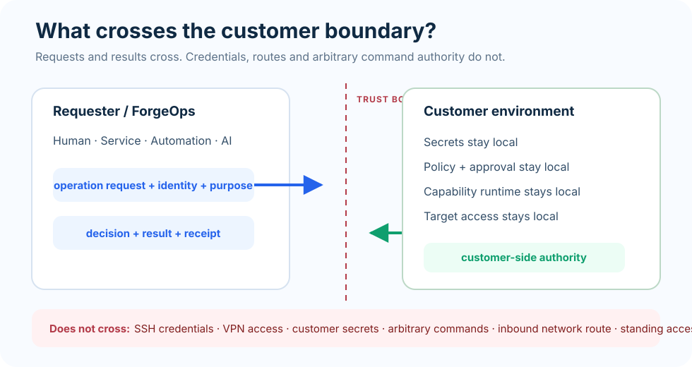
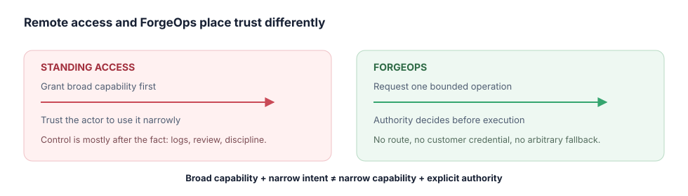

# Why this isn't remote access with extra steps

The reasonable first reaction is that this is a VPN with a nicer UI. Here is the
actual difference, and the ways it could be got wrong.

## The difference

Remote access grants a **capability to act**, then relies on the actor to act
narrowly. Standing SSH into a customer environment lets you do anything the
account can do; that you only ever restart one service is a matter of your
discipline, and the customer's audit log tells them afterwards.

ForgeOps grants **one operation at a time**, decided before it happens. The
requester holds no route and no credential. If the operation was not authorized,
there is nothing to misuse — not a policy against misuse, an absence of the
means.

## How it could be got wrong

Worth checking, in this or any system claiming the same thing:

**A general-purpose operation.** A capability that accepts an arbitrary command
is a shell with a longer name. The demo includes a shell request specifically so
you can watch it be refused.

**Approval that isn't separate.** If the requester can approve, the hold is
theatre. The demo has the AI requester attempt exactly that, and requires the
refusal.

**A credential that travels.** If the requester ever holds the customer's token,
the boundary is decorative.

**Authority that lives on the wrong side.** Policy the requester can edit is not
customer authority.

**Evidence produced by the actor.** If the only record of what happened comes
from the thing that did it, it is a claim, not evidence.

That last one is where the local demo is weakest, and we say so in
[what this demo does and does not prove](what-this-proves.md).

## The honest summary

ForgeOps is not a way to get access. It is a way to get **an operation done
without access** — which is worth something only if the operation is narrow, the
authority is genuinely elsewhere, and the refusal is real. Those three are what
to test.
