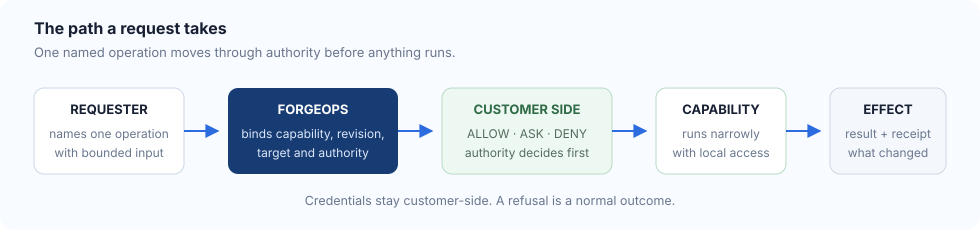

# What just happened

The demo deliberately showed you outcomes before mechanics. Here are the
mechanics.

## The path a request takes

Five things are worth noticing.

**The request names an operation, not a command.** You asked for
`acme.service.restart`, not for a shell that happens to run a restart. There is
no input to that operation that turns it into a different one.

**Authority is decided on the customer's side.** The hold in the demo was
released by a different identity than the one requesting. That separation is
the product; everything else is plumbing around it.

**The credential stays put.** The capability used a token that lives in the
edge's secrets file. It was never sent to the requester, and the run fails if it
appears anywhere it should not.

**A refusal is an outcome, not an error.** The shell request came back refused
by a named policy rule, with the target untouched. Nothing crashed; the system
did exactly what it is for.

**Nothing is delegated to a model.** When an AI makes the request instead of a
person, it takes the same path and gets the same answers. It can ask. It cannot
approve, and the demo checks that by having it try.

## What you can inspect

The run writes a record naming, for each operation: the action, the target, the
requester, the decision, the attempt result, and the receipt. `restart_count` on
the connector is readable before and after, which is how you can tell the denial
did nothing rather than being told so.

What that record does **not** contain — verification state and artifact identity
— is covered in [what this demo does and does not prove](what-this-proves.md).
Read it; the gaps are the interesting part.
