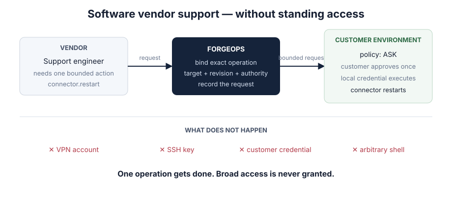

# Software vendor operating inside a customer environment

The primary case, and the one the demo models.



You ship a connector, agent, appliance or service that runs on your customer's
infrastructure. It occasionally needs something done to it: a diagnostic read, a
restart, a bounded fix. You do not control the environment it runs in, and you
should not need to.

## What it looks like today

```text
raise a ticket, ask the customer to do it themselves
a standing VPN account, provisioned once and never removed
an SSH key in a password manager, shared across your support rota
a screen-share where someone with credentials types what you dictate
your own agent, with its own permissions, which the customer now also has to trust
```

Each trades the same way: broad capability granted up front, narrow use promised
afterwards.

## What changes

The operation is named before it happens, the customer's own policy decides, and
the credential stays on their side. Your support engineer asks for
`connector.restart`; there is no input to that request that turns it into
anything else.

## Whether it fits you

It probably fits if the operations are **few, named, and repeated** — restart,
re-sync, rotate, collect diagnostics — and if the customer's objection to your
current approach is about access rather than about cost.

It probably does not fit if what you actually need is exploratory: a shell,
because you do not yet know what is wrong. ForgeOps makes bounded operations
safe to delegate. It does not make debugging bounded.
