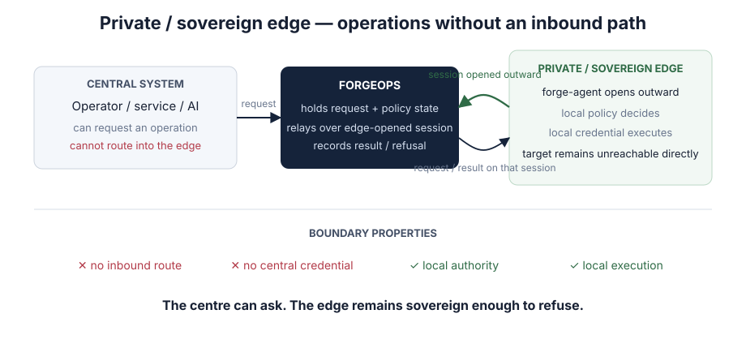

# Environments the centre cannot reach

A factory floor, a branch, a ship, a regulated estate, a customer network with no
inbound path. The common property: something has to happen there, and nothing
from outside may dial in.



## Why the usual answer does not work

Remote management assumes a route. Where the route is forbidden — by policy, by
regulation, by physics — the fallback is usually a person on site, or a standing
tunnel that exists because the alternative was worse.

## The shape

The edge opens the connection **outward**, and nothing ever dials in. Operations
arrive over that session as requests the local side is free to refuse. The
credential to act lives where the action happens.

```text
no inbound route
no standing tunnel
local policy decides, including when the link is down
the record survives the disconnection
```

## What this needs that the demo does not show

This is the case where the local demo is least convincing, because a laptop has
no boundary to cross. Seeing it properly means watching an operation reach a
machine you can confirm the requester cannot reach — a session, on real hardware,
rather than a page describing one.

If this is your situation, that is the conversation worth having.
